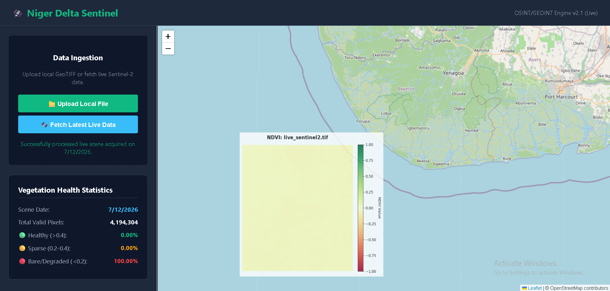

# 🛰️ Niger Delta Sentinel

**An OSINT/GEOINT Engine for Real-Time Ecological Monitoring**



## 📖 Overview
Niger Delta Sentinel is a geospatial intelligence platform that processes live Sentinel-2 satellite imagery from the European Space Agency (ESA) Copernicus Data Space. It calculates the Normalized Difference Vegetation Index (NDVI) to monitor vegetation health and ecological changes in the Niger Delta region.

## 🚀 Live Demo
**[Click here to view the live application](https://niger-delta-sentinel.onrender.com)**

## ️ Tech Stack
- **Backend:** Python, FastAPI, Rasterio, NumPy
- **Frontend:** HTML5, CSS3, Leaflet.js
- **Data Source:** ESA Copernicus Data Space Ecosystem (OData API)
- **Deployment:** Render Cloud

## 📊 Features
- **Live Data Ingestion:** Fetches the most recent satellite data directly from space.
- **Smart Cloud Filtering:** Automatically selects scenes with <30% cloud cover for clear analysis.
- **NDVI Calculation:** Processes multi-band GeoTIFFs to generate vegetation health maps.
- **Interactive Visualization:** Displays results on a dynamic Leaflet map with statistical breakdowns.

## 📸 How it Works
1. **Authentication:** Securely authenticates with the Copernicus API using OAuth2.
2. **Search & Filter:** Queries the OData API for the latest Sentinel-2 L2A scene over the Niger Delta, filtering for low cloud cover.
3. **Download & Process:** Downloads the raw ~1GB archive, extracts the Red (B04) and NIR (B08) bands, and calculates NDVI.
4. **Visualization:** Generates a web-ready map overlay and statistical report for the user.

## 🌍 Use Cases
- Environmental monitoring in the Niger Delta
- Vegetation health assessment
- Deforestation detection
- Agricultural monitoring
- Disaster response and damage assessment

## 🔧 Installation
```bash
git clone https://github.com/Devminimah/niger-delta-sentinel.git
cd niger-delta-sentinel
pip install -r requirements.txt

---

## 🤝 Contributing & License

This project is developed as an independent research initiative.

**Copyright & License:**<br>
Copyright © 2026 Abiegbu Minimah. All rights reserved.<br>
This project is proprietary. The source code is provided for portfolio and academic demonstration purposes only.
